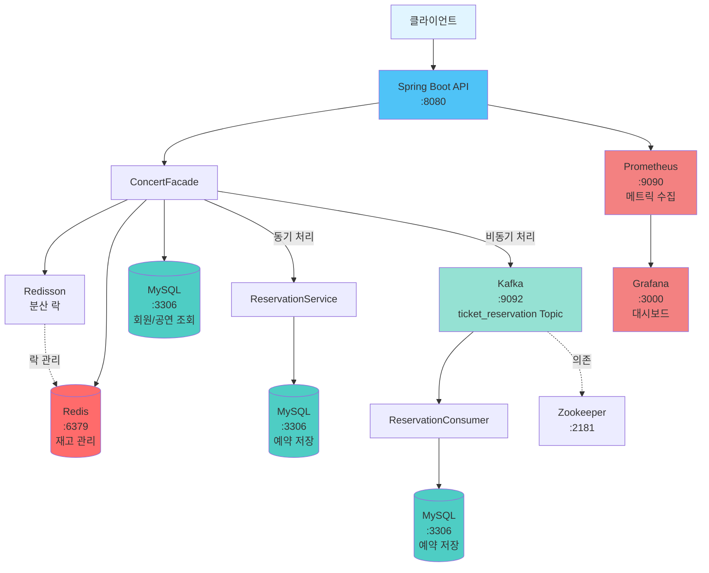

# 티켓팅 시스템 (Ticketing System)

고성능 동시성 제어를 위한 Spring Boot 기반 티켓팅 시스템입니다. Redis 분산 락, Kafka 비동기 처리, Prometheus/Grafana 모니터링을 지원합니다.

## 아키텍처

### 시스템 아키텍처 다이어그램

```mermaid
graph TB
    Client[클라이언트] --> API[Spring Boot API<br/>:8080]
    
    API --> Facade[ConcertFacade]
    
    Facade --> Redisson[Redisson<br/>분산 락]
    Facade --> Redis[(Redis<br/>:6379<br/>재고 관리)]
    Facade --> MySQL1[(MySQL<br/>:3306<br/>회원/공연 조회)]
    
    Facade -->|동기 처리| Service[ReservationService]
    Service --> MySQL2[(MySQL<br/>:3306<br/>예약 저장)]
    
    Facade -->|비동기 처리| Kafka[Kafka<br/>:9092<br/>ticket_reservation Topic]
    Kafka --> Consumer[ReservationConsumer]
    Consumer --> MySQL3[(MySQL<br/>:3306<br/>예약 저장)]
    
    API --> Prometheus[Prometheus<br/>:9090<br/>메트릭 수집]
    Prometheus --> Grafana[Grafana<br/>:3000<br/>대시보드]
    
    Redisson -.->|락 관리| Redis
    Kafka -.->|의존| Zookeeper[Zookeeper<br/>:2181]
    
    style Client fill:#e1f5ff
    style API fill:#4fc3f7
    style Redis fill:#ff6b6b
    style MySQL1 fill:#4ecdc4
    style MySQL2 fill:#4ecdc4
    style MySQL3 fill:#4ecdc4
    style Kafka fill:#95e1d3
    style Prometheus fill:#f38181
    style Grafana fill:#f38181
```